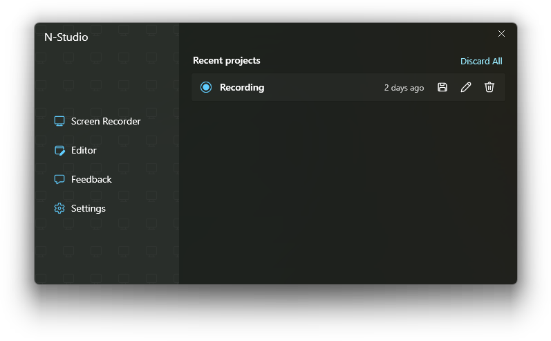
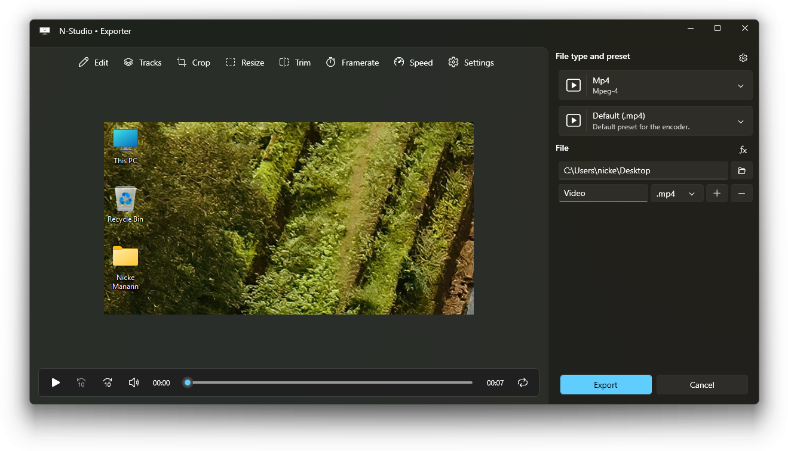

# Welcome to a new era for screen recording

I'm thrilled to announce the release of **N-Studio**!  
A completely new experience for screen recording, editing and exporting.  

## Key Highlights

### 1. Sleek User Interface

Say hello to a modern and intuitive user interface! 
I've designed the look and feel of N-Studio to make it visually appealing and user-friendly.

### 2. Powerful Workflow Boost

I've created the software engine to provide a significant performance boost.  
Go from starting the capture to export in a few clicks, with virtual no wait.  

### 3. Exciting Features

- **Customizable screen recording**: Record your screen, capture the cursor, key strokes and audio.  
- **Editting**: Fully-featured editor, with a timeline allowing you to control each track.    
- **Exporting**: Quickly edit the captured content and then preview and export.  

## What's Next?

I'm committed to continuous improvement, and your feedback is invaluable.  
If you know my previous work (_ScreenToGif_), then you know that I love to improve the software based on what you need.  
Please don't hesitate to [contact me](https://www.nicke.tech) if encounter any issues or if you have suggestions for future enhancements.

I hope you enjoy this software as much as I enjoyed creating it!